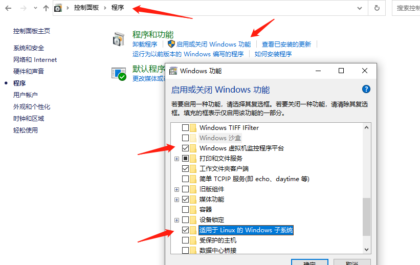
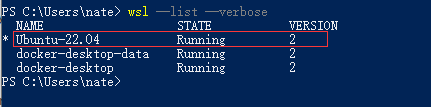
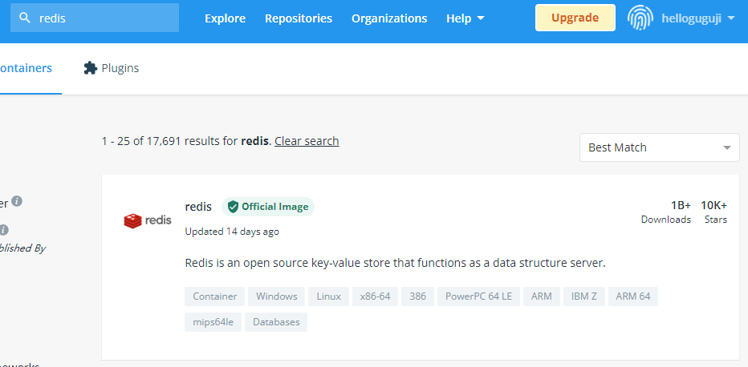
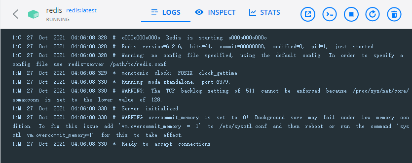

# Docker

## Docker 简介和安装

### 什么是 Docker

Docker 是一种容器技术(container)。在 Docker 中，容器是轻量级的、可移植的、自给自足的软件包，它封装了软件的代码以及运行该代码所需的所有依赖项（如库、系统工具、代码和运行时）。这使得应用程序可以在各种计算环境中快速、可靠地运行，而不受环境差异的影响。因此，Docker 容器提供了一种高效的方式来打包、分发和部署软件应用。

### 和普通虚拟机的对比

| 特性   | 普通虚拟机                                                   | Docker                                               |
| ------ | ------------------------------------------------------------ | ---------------------------------------------------- |
| 跨平台 | 通常只能在桌面级系统运行，例如 Windows/Mac，无法在不带图形界面的服务器上运行 | 支持的系统非常多，各类 windows 和 Linux 都支持       |
| 性能   | 性能损耗大，内存占用高，因为是把整个完整系统都虚拟出来了     | 性能好，只虚拟软件所需运行环境，最大化减少没用的配置 |
| 自动化 | 需要手动安装所有东西                                         | 一个命令就可以自动部署好所需环境                     |
| 稳定性 | 稳定性不高，不同系统差异大                                   | 稳定性好，不同系统都一样部署方式                     |

###  打包、分发、部署

**打包**：就是把你软件运行所需的依赖、第三方库、软件打包到一起，变成一个安装包

**分发**：你可以把你打包好的“安装包”上传到一个镜像仓库，其他人可以非常方便的获取和安装

**部署**：拿着“安装包”就可以一个命令运行起来你的应用，自动模拟出一摸一样的运行环境，不管是在 Windows/Mac/Linux。

### Docker 部署的优势

常规应用开发部署方式：

>  自己在 Windows 上开发、测试 --> 到 Linux 服务器配置运行环境部署。

Docker 开发部署流程：

> 自己在 Windows 上开发、测试 --> 打包为 Docker 镜像（可以理解为软件安装包） --> 各种服务器上只需要一个命令部署好

**优点：**确保了不同机器上跑都是一致的运行环境，不会出现我机器上跑正常，你机器跑就有问题的情况。

### Docker 通常用来做什么

- 应用分发、部署，方便传播给他人安装。特别是开源软件和提供私有部署的应用
- 快速安装测试/学习软件，用完就丢（类似小程序），不把时间浪费在安装软件上。例如 Redis / MongoDB / ElasticSearch / ELK
- 多个版本软件共存，不污染系统，例如 Python2、Python3，Redis4.0，Redis5.0
- Windows 上体验/学习各种 Linux 系统

### 重要概念：镜像、容器

**镜像**：可以理解为软件安装包，可以方便的进行传播和安装。

**容器**：软件安装后的状态，每个软件运行环境都是独立的、隔离的，称之为容器。

### 安装

桌面版：https://www.docker.com/products/docker-desktop

服务器版：https://docs.docker.com/engine/install/#server

### 启动报错解决

报错截图


**解决方法**：

控制面板->程序->启用或关闭 windows 功能，开启 Windows 虚拟化和 Linux 子系统（WSL2)


**命令行安装 Linux 内核**
 `wsl.exe --install -d Ubuntu`

> 你也可以打开微软商店 Microsoft Store 搜索 Linux 进行安装，选择一个最新版本的 Ubuntu 或者 Debian 都可以

> 上面命令很可能你安装不了，微软商店你也可能打不开，如果遇到这个问题，参考：https://blog.csdn.net/qq_42220935/article/details/104714114

**设置开机启动 Hypervisor**
`bcdedit /set hypervisorlaunchtype auto`

> 注意要用管理员权限打开 PowerShell

**设置默认使用版本2**
`wsl.exe --set-default-version 2`

**查看 WSL 是否安装正确**
`wsl.exe --list --verbose`
应该如下图，可以看到一个 Linux 系统，名字你的不一定跟我的一样，看你安装的是什么版本。
并且 VERSION 是 2


**确保 BIOS 已开启虚拟化，下图检查是否已开启好**

> 如果是已禁用，请在开机时按 F2 进入 BIOS 开启一下，不会设置的可以网上搜索下自己主板的设置方法，Intel 和 AMD 的设置可能稍有不同


**出现下图错误，点击链接安装最新版本的 WSL2**
https://wslstorestorage.blob.core.windows.net/wslblob/wsl_update_x64.msi


### 镜像加速源

| 镜像加速器          | 镜像加速器地址                       |
| ------------------- | ------------------------------------ |
| Docker 中国官方镜像 | https://registry.docker-cn.com       |
| DaoCloud 镜像站     | http://f1361db2.m.daocloud.io        |
| Azure 中国镜像      | https://dockerhub.azk8s.cn           |
| 科大镜像站          | https://docker.mirrors.ustc.edu.cn   |
| 阿里云              | https://ud6340vz.mirror.aliyuncs.com |
| 七牛云              | https://reg-mirror.qiniu.com         |
| 网易云              | https://hub-mirror.c.163.com         |
| 腾讯云              | https://mirror.ccs.tencentyun.com    |

```
"registry-mirrors": ["https://registry.docker-cn.com"]
```


## Docker 快速安装软件

### 直接安装的缺点

- 安装麻烦，可能有各种依赖，运行报错。例如：WordPress，ElasticSearch，Redis，ELK
- 可能对 Windows 并不友好，运行有各种兼容问题，软件只支持 Linux 上跑
- 不方便安装多版本软件，不能共存。
- 电脑安装了一堆软件，拖慢电脑速度。
- 不同系统和硬件，安装方式不一样

### Docker 安装的优点

- 一个命令就可以安装好，快速方便
- 有大量的镜像，可直接使用
- 没有系统兼容问题，Linux 专享软件也照样跑
- 支持软件多版本共存
- 用完就丢，不拖慢电脑速度
- 不同系统和硬件，只要安装好 Docker 其他都一样了，一个命令搞定所有

### 演示 Docker 安装 Redis

Redis 官网：https://redis.io/

> 官网下载安装教程只有源码安装方式，没有 Windows 版本。想要自己安装 windows 版本需要去找别人编译好的安装包。

Docker 官方镜像仓库查找 Redis ：https://hub.docker.com/


一个命令跑起来：`docker run -d -p 6379:6379 --name redis redis:latest`
命令参考：https://docs.docker.com/engine/reference/commandline/run/



### 安装 Wordpress

docker-compose.yml

```
version: '3.1'

services:

  wordpress:
    image: wordpress
    restart: always
    ports:
      - 8080:80
    environment:
      WORDPRESS_DB_HOST: db
      WORDPRESS_DB_USER: exampleuser
      WORDPRESS_DB_PASSWORD: examplepass
      WORDPRESS_DB_NAME: exampledb
    volumes:
      - wordpress:/var/www/html

  db:
    image: mysql:5.7
    restart: always
    environment:
      MYSQL_DATABASE: exampledb
      MYSQL_USER: exampleuser
      MYSQL_PASSWORD: examplepass
      MYSQL_RANDOM_ROOT_PASSWORD: '1'
    volumes:
      - db:/var/lib/mysql

volumes:
  wordpress:
  db:
```

### 安装 ELK

```
docker run -p 5601:5601 -p 9200:9200 -p 5044:5044 -it --name elk sebp/elk
```

[内存不够解决方法](https://docs.microsoft.com/en-us/windows/wsl/wsl-config#global-configuration-options-with-wslconfig)
转到用户目录 `cd ~`，路径类似这个：`C:\Users\<UserName>`
创建 `.wslconfig` 文件填入以下内容

```
[wsl2]
memory=10GB # Limits VM memory in WSL 2 to 4 GB
processors=2 # Makes the WSL 2 VM use two virtual processors
```

生效配置，命令行运行 `wsl --shutdown`

### 更多相关命令

`docker ps` 查看当前运行中的容器

`docker images` 查看镜像列表

`docker rm container-id` 删除指定 id 的容器

`docker stop/start container-id` 停止/启动指定 id 的容器

`docker rmi image-id` 删除指定 id 的镜像

`docker volume ls` 查看 volume 列表

`docker network ls` 查看网络列表

## 制作自己的镜像

### 为自己的 Web 项目构建镜像

示例项目代码：https://github.com/gzyunke/test-docker
这是一个 Nodejs + Koa2 写的 Web 项目，提供了简单的两个演示页面。
软件依赖：[nodejs](https://nodejs.org/zh-cn/)
项目依赖库：koa、log4js、koa-router

### 编写 Dockerfile

```dockerfile
FROM node:11
MAINTAINER easydoc.net

# 复制代码
ADD . /app

# 设置容器启动后的默认运行目录
WORKDIR /app

# 运行命令，安装依赖
# RUN 命令可以有多个，但是可以用 && 连接多个命令来减少层级。
# 例如 RUN npm install && cd /app && mkdir logs
RUN npm install --registry=https://registry.npm.taobao.org

# CMD 指令只能一个，是容器启动后执行的命令，算是程序的入口。
# 如果还需要运行其他命令可以用 && 连接，也可以写成一个shell脚本去执行。
# 例如 CMD cd /app && ./start.sh
CMD node app.js
```

[Dockerfile文档](https://docs.docker.com/engine/reference/builder/#run)

> 实用技巧：
> 如果你写 Dockerfile 时经常遇到一些运行错误，依赖错误等，你可以直接运行一个依赖的底，然后进入终端进行配置环境，成功后再把做过的步骤命令写道 Dockerfile 文件中，这样编写调试会快很多。
> 例如上面的底是`node:11`，我们可以运行`docker run -it -d node:11 bash`，跑起来后进入容器终端配置依赖的软件，然后尝试跑起来自己的软件，最后把所有做过的步骤写入到 Dockerfile 就好了。
> 掌握好这个技巧，你的 Dockerfile 文件编写起来就非常的得心应手了。

### Build 为镜像（安装包）和运行

编译 `docker build -t test:v1 .`

> `-t` 设置镜像名字和版本号
> 命令参考：https://docs.docker.com/engine/reference/commandline/build/

运行 `docker run -p 8080:8080 --name test-hello test:v1`

> `-p` 映射容器内端口到宿主机
> `--name` 容器名字
> `-d` 后台运行
> 命令参考文档：https://docs.docker.com/engine/reference/run/

### 更多相关命令

`docker ps` 查看当前运行中的容器

`docker images` 查看镜像列表

`docker rm container-id` 删除指定 id 的容器

`docker stop/start container-id` 停止/启动指定 id 的容器

`docker rmi image-id` 删除指定 id 的镜像

`docker volume ls` 查看 volume 列表

`docker network ls` 查看网络列表